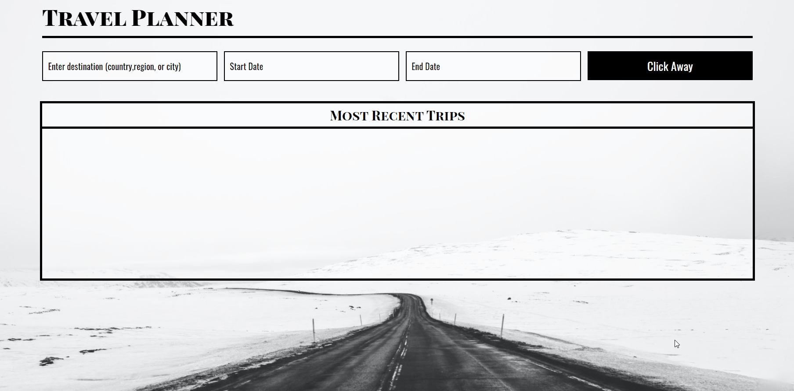

# TravelApp-Capstone-FEND
This's the fifth and last project in the Fron End Nanodegree at Udacity. TThe project requires you to build out a travel app that, at a minimum, obtains a desired trip location & date from the user, and displays weather and an image of the location using information obtained from external APIs.

 

## Table of Contents
1. Project Description
2. Project Prerequisites
3. API(s) Used
4. Development Strategy
5. How to Make Your Project Stand Out

 

## Project Description
The project will include a simple form where you enter the location you are traveling to and the date you are leaving. If the trip is within a week, you will get the current weather forecast. If the trip is in the future, you will get a predicted forecast. We are going to use the Weatherbit API . **Weatherbit API** has one problem, it only takes in coordinates for weather data -- it’s that specific. So, we’ll need to get those coordinates from the **Geonames API**. Once we have all of this data, we’ll want to display an image of the location entered; for this, we will be using the **Pixabay API**.

 

## Project Prerequisites
You should have good understanding of:
- HTML / CSS / SASS
- Responsive design
- JavaScript & DOM
- Node.js & express
- Webpack 
- Babel
- Testing

 

## API(s) Used
- [Weatherbit API](https://www.weatherbit.io/)
- [Geonames API](https://www.geonames.org/)
- [Pixabay API](https://pixabay.com/api/docs/)

 

## Development Strategy
1. You could duplicate the third project and start coding or start from scratch. 
2. in HTML, build a simple form that has an input where the user could write the location and two dates inputs and a sumbit button.
3. you might use CSS or SASS and make sure it's responsive.
4. Get webpack set up for the project.
5. Sign up for the API(s) you need to use and you could use more than three.
6. Add one item from the suggested list of how to make your project stand out.

 

## How to Make Your Project Stand Out
**At least one of these is required**, but the rest are great additional ways to further customize and improve your project!

- Add end date and display length of trip.
- Pull in an image for the country from Pixabay API when the entered location brings up no results (good for obscure localities).
- Allow user to add multiple destinations on the same trip.
    - Pull in weather for additional locations.
- Allow the user to add hotel and/or flight data.
    - Multiple places to stay? Multiple flights?
- Integrate the REST Countries API to pull in data for the country being visited.
- Allow the user to remove the trip.
- Use Local Storage to save the data so that when they close, then revisit the page, their information is still there.
- Instead of just pulling a single day forecast, pull the forecast for multiple days.
- Incorporate icons into forecast.
- Allow user to Print their trip and/or export to PDF.
- Allow the user to add a todo list and/or packing list for their trip.
- Allow the user to add additional trips (this may take some heavy reworking, but is worth the challenge).
    - Automatically sort additional trips by countdown.
    - Move expired trips to bottom/have their style change so it’s clear it’s expired.